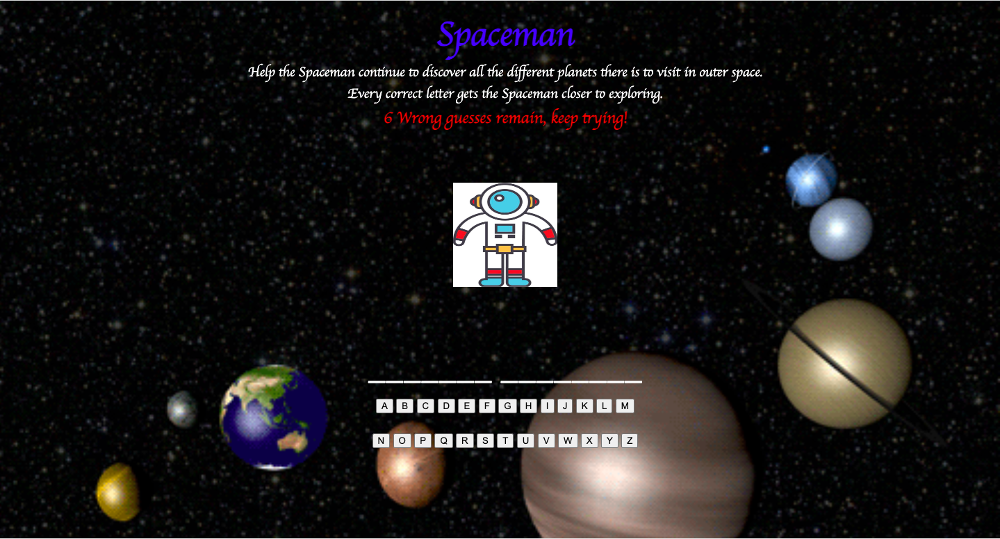

# Spaceman

*Spaceman found his passion in life:* to explore every planet he could, but the only way to continue doing so is with your help. The player who chooses to help Spaceman on his journey is given six wrong guesses to help him get closer to his next planet. Every wrong guess the player makes, a body part starting with Spaceman's leg disappears. But for the Spaceman to continue exploring each world, a player has to guess each word correctly, or else, each part of the Spaceman's body parts, starting from his legs, disappears. The spaceman needs the player's help to continue exploring all the different planets. Once you have guessed the correct word, the Spaceman is off the explore. If you fail, the spaceman is out of space and back to earth, but remember, you are given a chance to try again.

**Technologies Used:**
JavaScript
HTML
CSS

**Getting Started:**
*Click on the link below to play!*
(https://xcbhx.github.io/Spaceman/)

**Next Steps:**
One of my future enhancements would be adding categories so players can select from a list of different categories. 
The second enhancement would be to add audio, so it can play while the users are interacting with the page. 