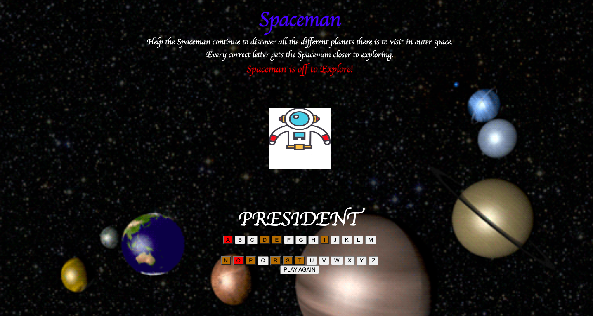
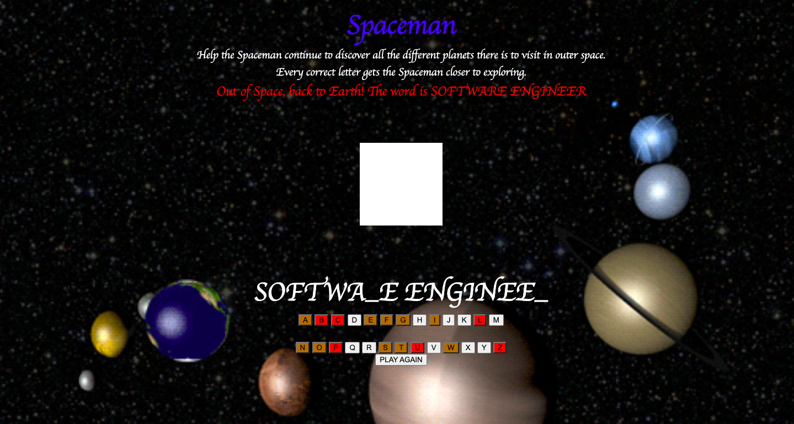

<h1 align="center"> Spaceman </h1>

## *This Spaceman version of the game is set in outer space. Players help Spaceman discover new planets by guessing the correct letters for each word.* 
 

## Screenshots:
#### The player who chooses to help Spaceman on his journey is given six wrong guesses to help him get closer to his next planet.

#### Once the player have guessed the correct word, the Spaceman is off the explore.

#### If the player fails, the Spaceman is out of space and back to earth.

## **Technologies Used:**  

## **Getting Started:**  
<a href="https://xcbhx.github.io/Spaceman/">Deployed Link</a>

## **Next Steps:**  
<ul>
<li>One of my future enhancements would be adding categories so players can select from a list of different categories.</li> 
<li>The second enhancement would be to add audio, so it can play while the users are interacting with the page.</li>
<li>The third enhancement would be to add a gif of spaceman on a rocketship when the game has been won.</li>
</ul>
