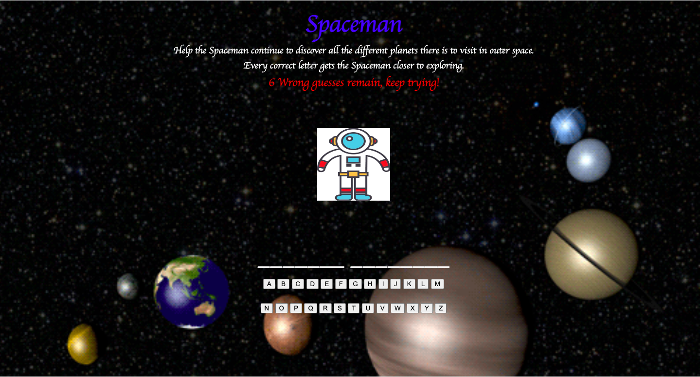

# Spaceman

## *This Spaceman version of the game is set in outer space. The player who chooses to help Spaceman on his journey is given six wrong guesses to help him get closer to his next planet. Once you have guessed the correct word, the Spaceman is off the explore. If you fail, the spaceman is out of space and back to earth, but remember, you are given a chance to try again.* 
 

# **Technologies Used:**  
HTML  
JavaScript 
CSS

# **Getting Started:**  
*Click on the link below to play!*  
(https://xcbhx.github.io/Spaceman/)

# **Next Steps:**  
One of my future enhancements would be adding categories so players can select from a list of different categories.  
The second enhancement would be to add audio, so it can play while the users are interacting with the page. 